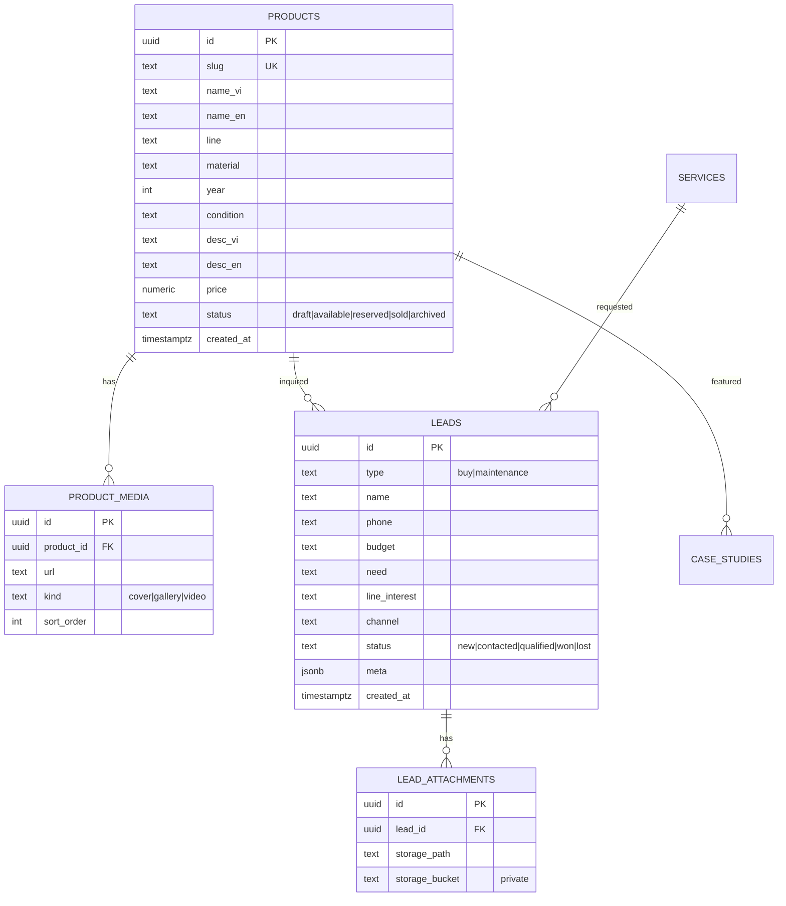
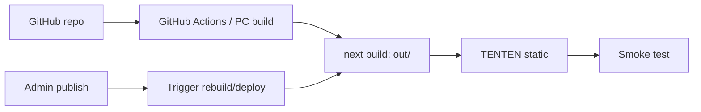
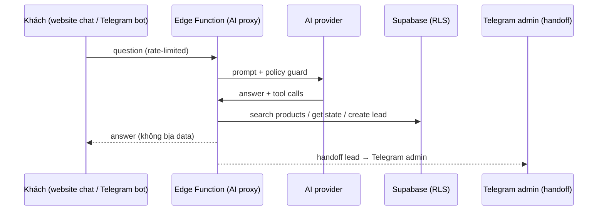

# ARCHITECT — SangDupont System Architecture

> Status: **PLAN — chờ duyệt** (cùng gói với MASTER_PLAN)
> Created: 2026-08-14 · Author: Mika
> Nguồn: file kế hoạch tinh gọn §3 (static-first chốt) + capabilities Hermes §Kiến trúc vai trò
> Nguyên tắc trên hết: **static-first, compute offload, build off-host, không Node thường trực khi chưa cần**

---

## 1. TỔNG QUAN HỆ THỐNG (2 lớp)

```text
LỚP 1 — PUBLIC WEBSITE (khách)
Browser
  ├── HTML/CSS/JS static (Next.js export) ───────────► TENTEN (hoặc Vercel hiện tại)
  ├── product/content data ──────────────────────────► Supabase (đọc data LÚC BUILD ở Release A; RLS-read chỉ là đường fallback sau này)
  ├── admin auth / CRUD ─────────────────────────────► Supabase Auth + RLS (admin only)
  ├── product media ─────────────────────────────────► Supabase Storage (public bucket)
  └── sensitive actions (lead/Telegram/AI) ──────────► Supabase Edge Functions (server-side)

LỚP 2 — HERMES AI OPERATING LAYER (nội bộ + public concierge)
INTERNAL: Anh → Hermes (Pi5) → GitHub → GitHub Actions → TENTEN deploy
          ├── Content/CMS · Image analysis · Website operator
          ├── Research/sourcing · Competitor intel · Analytics
          └── Git operations (code/quản trị repo)
PUBLIC:   Khách → Telegram Bot → Hermes profile restricted
          ├── Product lookup (read-only) · FAQ/service lookup
          ├── Vision intake · Create lead · Human handoff → Supabase
```

**Tách nguồn sự thật (capabilities §Nguồn dữ liệu)**:
| Nguồn | Chứa gì |
|---|---|
| Git (canonical content) | products, services, FAQ, policies, website content |
| Supabase (operational) | leads, customer data, uploads, repair requests, CRM |
| Research DB (riêng) | seller/source, competitor, listing, observed price, first/last_seen, watchlist |
| **KHÔNG dùng Hermes MEMORY** | giá, tồn kho, lead, research data — chỉ nguồn có cấu trúc |

---

## 2. STACK CHỐT (phán quyết file 1 §15)

| Thành phần | Chọn | Lý do |
|---|---|---|
| Framework | Next.js App Router + TypeScript (strict) | Bảo trì, i18n, SEO, static export |
| Render | **Static export** `output: 'export'` (Release A) | Catalog nhỏ, ít trang, RAM/CPU TENTEN ~0 |
| Host | TENTEN (target) — Vercel hiện tại (bridge) | Kế hoạch chốt TENTEN; static = host-agnostic |
| Database | Supabase Free (PostgreSQL) | Metadata/text/lead; không nhét binary |
| Auth | Supabase Auth, admin only, tắt public signup | CMS nội bộ |
| Storage | Supabase Storage: product public, lead **private** | Ảnh không ăn disk host |
| Server logic | Supabase Edge Functions | Telegram, signed/private, anti-abuse, AI proxy |
| AI provider | Gọi qua Edge Function — **không secret ở client** | Release B |
| Analytics | GA4 + Search Console | Events tối thiểu |

**KHÔNG dùng ở Release A**: Node server thường trực, ISR (cache disk), runtime image optimization, realtime, cron/worker trên host, SSR cho nội dung static được.

---

## 3. DATA MODEL CORE (schema tối thiểu — file 1 §7)



+ Bảng nội dung: `SERVICES`, `TESTIMONIALS`, `CASE_STUDIES`, `FAQ` (VI/EN fields), `SITE_SETTINGS`.
+ Release B: `AI_CONVERSATIONS` / `AI_SUMMARIES` (log usage, eval).
+ **Không mở rộng schema khi chưa có use case thật** (file 1 §7).
+ Index bắt buộc: `products.slug`, `products.status`, `leads.created_at` (file 1 §8).

---

## 4. BẢO MẬT (security model)

| Lớp | Cơ chế |
|---|---|
| DB | RLS bắt buộc mọi bảng exposed: public chỉ đọc `status=available` products + public content; leads/attachments **admin-only** |
| Secrets | Telegram bot token, service-role key, AI key — **chỉ trong Edge Functions env**, không bao giờ client |
| Auth | Admin only, tắt public signup; không multi-role phức tạp |
| Storage | Bucket product = public (ảnh đã tối ưu); bucket lead = private (RLS + signed URL ngắn hạn qua Edge Function) |
| Anti-abuse | Turnstile trên form public; rate limit Edge Function |
| AI public | Guard: quota/session, token cap, bot protection, timeout, cost cap, kill switch, log usage, eval cố định |

**Nguyên tắc**: "Không dùng Edge Function cho việc browser + RLS làm an toàn được" (file 1 §8).

---

## 5. DEPLOY & BUILD FLOW



- **Không build trên TENTEN** — artifact chỉ mang file cần chạy
- Deploy không mang: `.git`, `node_modules`, `.next/cache`, preview screenshots, crawl data, backup lớn, ảnh gốc không cần
- Ảnh: WebP/AVIF tối ưu trước upload; logo/icon nhỏ giữ static assets
- Rollback: giữ artifact production trước; frontend lỗi → redeploy artifact cũ; migration backward-compatible; backup DB trước migration quan trọng
- Release B+: website vẫn static; AI chạy Edge Function proxy → không ảnh hưởng host khi AI lỗi

---

## 6. AI ARCHITECTURE (Release B → Full AI)



- Tool calling **chỉ 3 tools validated**: search products, get product state, create lead/handoff
- Policy AI: không bịa sản phẩm/giá/tồn kho; không khẳng định thật/giả; không tự chốt giá/cam kết bảo hành; không tự sửa production data
- Không dùng Release B: vector DB lớn, RAG nhiều tầng, agent đa bước phức tạp, browser automation, tool quyền rộng
- Full AI: AI nội bộ draft (admin duyệt trước publish) + vision intake (không chốt thật/giả, không định giá) + research pipeline

---

## 7. HERMES PROFILE ROLES

| Profile | Quyền | Vai trò |
|---|---|---|
| Internal Hermes (mika/researcher) | code/git/research/analytics | Content/CMS, website operator, research, price intel |
| **Public concierge** (profile riêng, giới hạn) | Telegram bot, product lookup read-only, FAQ, create lead | Sales concierge — **không** shell/fs/git/web tự do/subagent |

---

## 8. VERIFICATION STRATEGY (map theo phase)

- P1: `npm run lint` + `tsc --noEmit` + `npm run build` + browser verify visual parity
- P2: RLS test (public không đọc lead/private), migration replay từ sạch
- P3: 100% product published hợp lệ (slug/cover/status/metadata), route VI/EN test
- P4: admin CRUD test, RLS write block test
- P5: lead lưu + Telegram notify + private upload test
- P6: Lighthouse ≥ 85 mobile / ≥ 90 desktop; A11y/SEO/BP ≥ 90; GA4 events
- P7: Full regression + smoke deploy + rollback test
- P8: eval cố định, handoff end-to-end, cost cap test
- P9: human-review gate, disclaimer, usage/cost/kill switch

**Cross-cutting**: mọi phase chạm DB/auth/backend/production → Reviewer gate (CONTROLLED) theo AGENTS.md.

---

## 9. NON-GOALS & BOUNDARIES (nhắc lại từ MASTER_PLAN)

Không checkout online, marketplace, app mobile, realtime, Redis, vector DB/RAG lớn, voice AI, AI tự đăng bài, AI tự định giá/thật-giả, multi-role admin, SSR toàn site, image transform động trên shared hosting. Không chuyển `output: 'standalone'` trừ khi static-first là nút thắt vận hành thật (file 1 §10).
